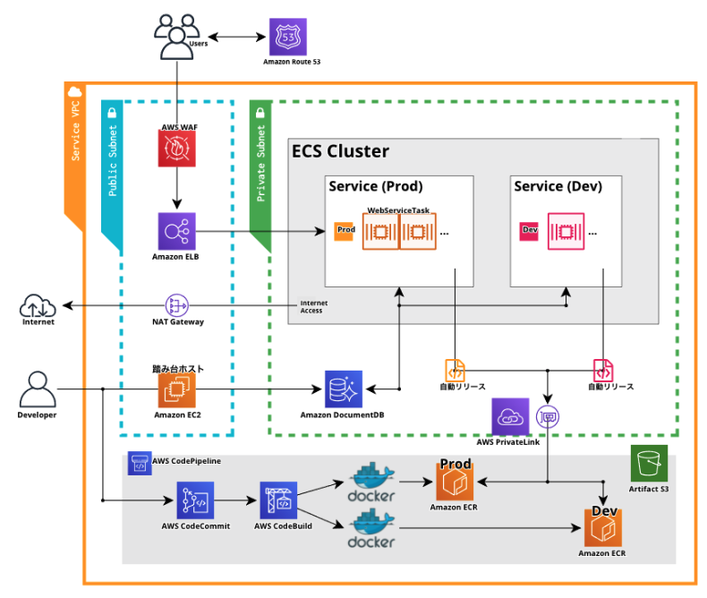

# [MeTube](https://metube.solarsdev.com/)

- ユーチューブをクローンしたウェブサイト（ver. 2021）

##### 既存バージョンとの違い

- Dockerize
- AWS managed CICD (using CodePipiline)
- ECS でコンテナー化

##### このプロジェクトで利用した技術スタック

- Pug (html template engine for nodejs)
- JavaScript
- Scss
- webpack
- Node.js
- MongoDB `as AWS DocumentDB`
- Docker
- AWS
  - CloudFormation (Infrastructure as Code)
  - CloudFront (Serve images, videos from CDN)
  - CodePipeline (AWS managed CICD)
  - CodeBuild (using build docker and push to ECR)
  - DocumentDB (AWS managed MongoDB)
  - S3 (Uploaded images, videos goes into AWS Storage)

## SourceCode Structure

```bash
.
├── cloudformation
│   ├── compute-stack.yml    # ECS, Fargate, Load Balancer etc..
│   ├── database-stack.yml   # not yet
│   ├── network-stack.yml    # not yet
│   └── vpc-stack.yml        # vpc, public, private subnets, igw, nat etc..
├── src
│   ├── auth
│   │   └── rds-combined-ca-bundle.pem  # ssl for DocumentDB
│   ├── client                          # Frontend stuff
│   │   ├── images
│   │   ├── js
│   │   └── scss
│   ├── controllers
│   │   ├── userController.js
│   │   └── videoController.js
│   ├── db.js
│   ├── init.js
│   ├── middlewares.js
│   ├── models
│   │   ├── User.js
│   │   └── Video.js
│   ├── passport.js
│   ├── routers
│   │   ├── authRooter.js
│   │   ├── rootRouter.js
│   │   ├── userRouter.js
│   │   └── videoRouter.js
│   ├── server.js
│   └── views
├── Dockerfile          # to build Docker
├── babel.config.json
├── buildspec.yml       # AWS CodeBuild
├── nodemon.json
├── package-lock.json
├── package.json
└── webpack.config.js   # Webpack config
```

## インフラ構成図



## Dockerize

デモ環境は AWS CodeBuild を利用して自動的に ECR にビルドされ、ECS に配布します。
個別テスト用に Docker Image を作成するには下記のコマンドで。

##### ビルドコマンド

```bash
$ docker image build . -t <accountName>/<imageName>
```

##### 起動コマンド

```bash
$ docker container run -p <hostPort>:4000 -d <accountName>/<imageName>
```

## ToDos

##### グローバル

- [x] / &ensp;：&ensp; ホームページ
- [x] /join &ensp;：&ensp; 会員登録
- [x] /login &ensp;：&ensp; ログイン
- [x] /logout &ensp;：&ensp; ログアウト
- [ ] /search &ensp;：&ensp; 検索

##### ユーザー

- [ ] /users/:id &ensp;：&ensp; ユーザーのプロフィール
- [ ] /users/edit &ensp;：&ensp; 自分のアカウント情報を編集
- [ ] /users/delete &ensp;：&ensp; 自分のアカウント削除

##### ビデオ

- [ ] /videos/:id &ensp;：&ensp; 動画視聴
- [ ] /videos/:id/edit &ensp;：&ensp; 動画の説明編集
- [ ] /videos/:id/delete &ensp;：&ensp; 動画削除
- [ ] /videos/upload &ensp;：&ensp; 動画のアップロード
